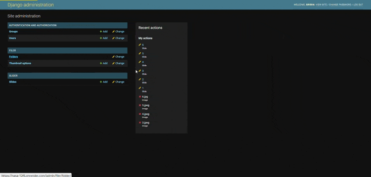
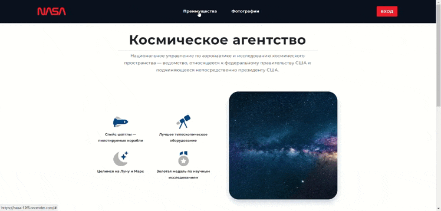

# NASA

Проект представляет собой решение тестового задания от компании Вангер.рф.

Для развертывания приложения, выполненного в соответствии с техническим заданием, следуйте инструкциям раздела "Запуск проекта".

Так же для удобства проверки работоспособности приложения, я задеплоил проект на хостинг: https://nasa-12f6.onrender.com. В продакшн среде проект использует облачное хранилище YandexCloud, а так же удаленную базу данных PostgreSQL.

Так же вы можете ознакомиться с демонстрацией работы проекта в разделе "Демонстрация работоспособности".
***

## Запуск проекта

Для запуска приложения выполните следующие шаги:

1. Склонируйте репозиторий на локальную машину:

```
git clone https://github.com/GrigoriyKruchinin/NASA.git
```


2. Перейдите в каталог проекта:

```
cd NASA
```


3. Установите зависимости.
- Установка зависимостей с помощью Poetry:

```
poetry shell
poetry install
```

- Также по условиям задания в корне проекта есть файл `req.pip`, и установить зависимости можно через него:

```
# Создание виртуального окружения
python3 -m venv .venv

# Активация виртуального окружения
source .venv/bin/activate

# Установка зависимостей из файла req.pip
pip install -r req.pip
```


4. Cоздайте копию файла `.env.example` в `.env`:
```
cp .env.example .env
```

Следуйте рекомендациям, описанным в файле, при заполнении своих данных.


5. Убедитесь, что у вас установлен MySQL и все необходимые для его работы пакеты.

```
sudo apt update
sudo apt install mysql-server mysql-client libmysqlclient-dev
```

- Запустите MySQL сервер:
```
sudo systemctl start mysql
```

- Зайдите в оболочку MySQL:
```
sudo mysql -u root -p
```

- Создайте новую базу данных:

```
CREATE DATABASE nasa_db;
```

- Создайте нового пользователя и задайте пароль:
```
CREATE USER 'nasa_user'@'localhost' IDENTIFIED BY 'your_password';
```
- Предоставьте пользователю доступ к базе данных:
```
GRANT ALL PRIVILEGES ON nasa_db.* TO 'nasa_user'@'localhost';
FLUSH PRIVILEGES;
```

- Запишите информацию о базе данных в `.env`.

6. Создайте суперпользователя:

```
make createsuperuser
```


7. Создайте и примените миграции:

```
make migrations

make migrate
```


8.  Запустите проект с помощью команды:
```
make runserver
```


9.  Зайдите в панель админа, используя логин и пароль созданного ранее супер пользователя: http://127.0.0.1:8000/admin 

10.  Проверьте возможность удобно загружать фотографии и менять их местами. Загрузите все фотографии из `media/sliders` и создайте 6 слайдов из доступных фото.

11.  Проверьте работоспособность слайдера, перейдя по адресу: http://127.0.0.1:8000


***


## Демонстрация работоспособности





***

## Благодарность и контакты

Буду рад обратной связи и надеюсь на дальнейшее взаимойдествие!

- Автор: Grigoriy Kruchinin
- [GitHub](https://github.com/GrigoriyKruchinin)
- [Email](mailto:gkruchinin75@gmail.com)
- [LinkedIn](https://www.linkedin.com/in/grigoriy-kruchinin/)